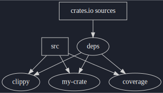
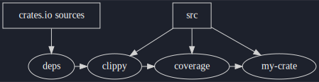

+++
title = "Introducing Crane: Composable and Cacheable Builds with Cargo and Nix"
description = "Crane is a Nix library for building cargo projects"
date = 2022-01-22
updated = 2022-01-23

[taxonomies]
tags = ["NixOS", "rust", "cargo", "crane"]
+++

I'm pleased to announce the initial release of [Crane]: a Nix library for
building cargo projects!

In a nutshell it offers:
* **Source fetching**: automatically done using a Cargo.lock file
* **Incremental**: build your workspace dependencies just once, then quickly lint,
  build, and test changes to your project without slowing down
* **Composable configuration**: split builds and tests into granular steps. Gate CI without
  burdening downstream consumers building from source.

<!-- more -->

# Acknowledgements

I want to take a moment to acknowledge and give credit to the impressive work
behind [Naersk]. It has been a huge source of inspiration, especially since it
absolutely nails a number of features like:
* automatic dependency handling with out needing to mess with SHAs yourself
* dependency artifacts can be built, cached, and reused independently of the
  project's source, making it a great fit for running in CI
* the defaults "just work" out of the box, regardless if a project is building
  applications, libraries, or an entire workspace of crates

## Motivation

My biggest motivation for writing Crane was wanting to use an API that allows
for build configurations which feel intuitive to write and easy to reconfigure
without sacrificing the performance of cacheable artifacts.

I find Naersk's configuration options work best when you are intimately familiar
with its internals. And if you aren't, even a goal like "run clippy on the
project" can leave you having to face evaluation errors, build errors,
accidental cache invalidation, or the acceptance that a fraction of your build
dependencies just have to be built twice...

# Philosophy

Crane is designed around the idea of composing cargo invocations such that they
can take advantage of the artifacts generated in previous invocations. This
allows for both flexible configurations and great caching (à la Cachix) in CI
and local development builds.

Here's how it works at a high level: when a cargo workspace is built its source
is first transformed such that only the dependencies listed by the `Cargo.toml`
and `Cargo.lock` files are built, and none of the crate's real source is
included. This allows cargo to build all dependency crates and prevents Nix from
invalidating the derivation whenever the source files are updated. Then, a
second derivation is built, this time using the real source files, which also
imports the cargo artifacts generated in the first step.

This pattern can be used with any arbitrary sequence of commands, regardless of
whether those commands are running additional lints, performing code coverage
analysis, or even generating types from a model schema. Let's take a look at two
examples at how very similar configurations can give us very different behavior!

## Example One

Suppose we are developing a crate and want to run our CI assurance checks
via `nix flake check`. Perhaps we want the CI gate to be very strict and block
any changes which raise warnings when run with `cargo clippy`. Oh, and we want
to enforce some code coverage too!

Except we do not want to push our strict guidelines on any downstream consumers
who may want to build our crate. Suppose they need to build the crate with a
different compiler version (for one reason or another) which comes with a new lint
whose warnings we have not yet addressed. We don't want to make their life
harder, so we want to make sure we do not run `cargo clippy` as part of the
crate's actual derivation, but at the same time, we don't want to have to
rebuild dependencies from scratch.

Here's how we can set up our flake to achieve our goals:

```nix
{
  inputs = {
    nixpkgs.url = "github:NixOS/nixpkgs/nixpkgs-unstable";
    crane.url = "github:ipetkov/crane";
    crane.inputs.nixpkgs.follows = "nixpkgs";
    flake-utils.url = "github:numtide/flake-utils";
    flake-utils.inputs.nixpkgs.follows = "nixpkgs";
  };

  outputs = { self, nixpkgs, crane, flake-utils, ... }:
    flake-utils.lib.eachDefaultSystem (system:
      let
        pkgs = import nixpkgs {
          inherit system;
        };

        craneLib = crane.lib.${system};
        src = ./.;

        # Build *just* the cargo dependencies, so we can reuse
        # all of that work (e.g. via cachix) when running in CI
        cargoArtifacts = craneLib.buildDepsOnly {
          inherit src;
        };

        # Run clippy (and deny all warnings) on the crate source,
        # resuing the dependency artifacts (e.g. from build scripts or
        # proc-macros) from above.
        #
        # Note that this is done as a separate derivation so it
        # does not impact building just the crate by itself.
        my-crate-clippy = craneLib.cargoClippy {
          inherit cargoArtifacts src;
          cargoClippyExtraArgs = "-- --deny warnings";
        };

        # Build the actual crate itself, reusing the dependency
        # artifacts from above.
        my-crate = craneLib.buildPackage {
          inherit cargoArtifacts src;
        };

        # Also run the crate tests under cargo-tarpaulin so that we can keep
        # track of code coverage
        my-crate-coverage = craneLib.cargoTarpaulin {
          inherit cargoArtifacts src;
        };
      in
      {
        defaultPackage = my-crate;
        checks = {
         inherit
           # Build the crate as part of `nix flake check` for convenience
           my-crate
           my-crate-clippy
           my-crate-coverage;
        };
      });
}
```

When we run `nix flake check` the following will happen:
1. The sources for any dependency crates will be fetched
1. They will be built without our crate's code and the artifacts propagated
1. Our crate, the clippy checks, and code coverage collection will be built,
   each reusing the same set of artifacts from the initial source-free build. If
   enough cores are available to Nix it may build all three derivations
   completely in parallel, or schedule them in some arbitrary order.

Splitting up our builds like this also gives us the benefit of granular control
over what is rebuilt. Suppose we change our mind and decide to adjust the clippy
flags (e.g. to allow certain lints or forbid others). Doing so will _only_
rebuild the clippy derivation, without having to rebuild and rerun any of our
other tests!

<figure>
  
  <figcaption>
    The arrows show which way the results "flow", from sources (represented in
    boxes) to intermediate and final derivations (represented as circles).
  </figcaption>
</figure>

## Example Two

Let's take an alternative approach to the example above. Suppose instead that we
care more about not wasting any resources building certain tests (even if they
would succeed!) if another particular test fails. Perhaps binary substitutes are
readily available so that we do not mind if anyone building from source is bound
by our rules, and we can be sure that all tests have passed as part of the
build.

```nix
{
  inputs = {
    nixpkgs.url = "github:NixOS/nixpkgs/nixpkgs-unstable";
    crane.url = "github:ipetkov/crane";
    crane.inputs.nixpkgs.follows = "nixpkgs";
    flake-utils.url = "github:numtide/flake-utils";
    flake-utils.inputs.nixpkgs.follows = "nixpkgs";
  };

  outputs = { self, nixpkgs, crane, flake-utils, ... }:
    flake-utils.lib.eachDefaultSystem (system:
      let
        pkgs = import nixpkgs {
          inherit system;
        };

        craneLib = crane.lib.${system};
        src = ./.;

        # Build *just* the cargo dependencies, so we can reuse
        # all of that work (e.g. via cachix) when running in CI
        cargoArtifacts = craneLib.buildDepsOnly {
          inherit src;
        };

        # First, run clippy (and deny all warnings) on the crate source.
        my-crate-clippy = craneLib.cargoClippy {
          inherit cargoArtifacts src;
          cargoClippyExtraArgs = "-- --deny warnings";
        };

        # Next, we want to run the tests and collect code-coverage, _but only if
        # the clippy checks pass_ so we do not waste any extra cycles.
        my-crate-coverage = craneLib.cargoTarpaulin {
          inherit src;
          cargoArtifacts = my-crate-clippy;
        };

        # Build the actual crate itself, _but only if the previous tests pass_.
        my-crate = craneLib.buildPackage {
          cargoArtifacts = my-crate-coverage;
          inherit src;
        };
      in
      {
        defaultPackage = my-crate;
        checks = {
         inherit
           # Build the crate as part of `nix flake check` for convenience
           my-crate
           my-crate-coverage;
        };
      });
}
```

When we run `nix flake check` the following will happen:
1. The sources for any dependency crates will be fetched
1. They will be built without our crate's code and the artifacts propagated
1. Next the clippy checks will run, reusing the dependency artifacts above.
1. Next the code coverage tests will run, reusing the artifacts from the clippy
   run
1. Finally the actual crate itself is built

In this case we lose the ability to build derivations independently, but we gain
the ability to enforce a strict build order. However, we can easily change our
mind, which would be much more difficult if we had written everything as one
giant derivation.

<figure>
  
  <figcaption>
    The arrows show which way the results "flow", from sources (represented in
    boxes) to intermediate and final derivations (represented as circles).
  </figcaption>
</figure>

# Try it out

I wanted to get an initial version out in the open, but there is, of course,
more work to be done. Support for git dependencies and private registries is
missing, but something I'd like to add in the near future.

In the meantime, feel free to check it out for yourself and kick the tires. The
[getting started] guide, [examples], and [API] documentation will be useful
resources.

I'd love to know what you think!

[API]: https://github.com/ipetkov/crane/blob/master/docs/API.md
[Crane]: https://github.com/ipetkov/crane
[examples]: https://github.com/ipetkov/crane/tree/master/examples
[getting started]: https://github.com/ipetkov/crane#getting-started
[Naersk]: https://github.com/nix-community/naersk
